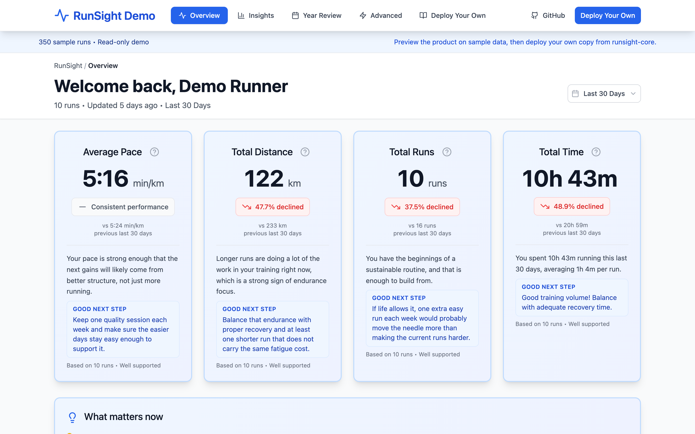
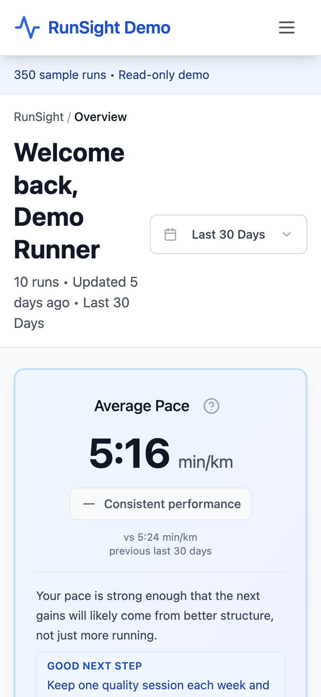
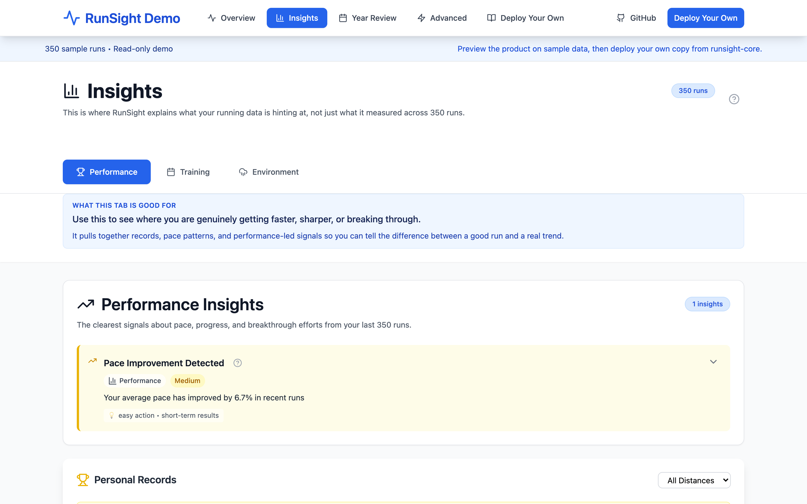
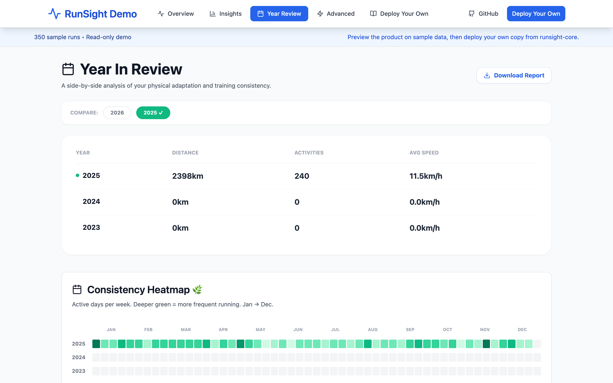

<div align="center">
  <h1>🏃 RunSight</h1>
  <p><b>Your Data. Your Rules. The ultimate self-hosted Strava analytics dashboard.</b></p>
</div>

<p align="center">
  
  
</p>

<p align="center">
  
  
</p>

## 🚀 Why RunSight?

RunSight is a fun exploration project that allows you to extend on top of Strava. It is not a competing product, but rather a self-hosted playground for runners who love data and want to build their own custom insights using Strava's API.

- 🔒 **100% Private & Self-Hosted:** Run your own private dashboard. Your runs stay yours.
- 🏃 **Advanced Analytics:** Discover custom trends like Pace vs. Heart Rate, long-term consistency, and personalized Year-in-Review stats.
- 🌤️ **Weather Enrichment:** Automatically pulls historical weather data for your runs so you can finally prove that the heat is slowing you down.
- 🛠️ **Hackable & Free:** Built to run on the generous free tiers of Netlify and Supabase, so you can easily extend it with your own features.

> **Want to see it in action?** Check out the [Live Demo](https://runsight.netlify.app)! *(No login required, powered by mock data)*

## ✨ What You Get

<p align="center">
  
  
</p>

- **A Beautiful Dashboard:** A modern, mobile-optimized view of your running journey.
- **Deep Insights:** Spot outliers in your training, track your consistency, and map out your longest efforts.
- **Historical Weather Data:** Automatic enrichment mapping temperature and conditions to your runs.
- **Year in Review:** Beautifully visualized annual recaps.

## ⚡ 15-Minute Quick Start

Deploying your own instance of RunSight is simple. You don't need to be a developer—you just need to copy a few API keys!

1. **Fork or clone this repository.**
2. **Set up the Database:** 
   - Create a free [Supabase](https://supabase.com) project.
   - **Why?** RunSight needs a database to store your synced Strava runs securely. By default, a new Supabase project is completely empty.
   - **How?** Open your Supabase Dashboard, go to the **SQL Editor** tab, paste the contents of `supabase/migrations/00-initial-schema.sql`, and click "Run". This creates the required tables and security policies. If you skip this, the app won't be able to save your data!
3. **Deploy the App:** Import your repo into [Netlify](https://netlify.com).
   - Build command: `npm run build`
   - Publish directory: `dist`
4. **Connect Strava:** Grab your final Netlify URL and create an API application in your Strava settings.
5. **Add Environment Variables:** Add your keys to Netlify (see below).
6. **Sync:** Open your live site, click "Connect with Strava", and watch your runs populate!

For the detailed, step-by-step walkthrough, check out the **[Full Deployment Guide](docs/DEPLOYMENT.md)**.

## 🔑 Required Environment Variables

You will need to provide these to your Netlify site settings:

```bash
STRAVA_CLIENT_ID=your_strava_client_id
STRAVA_CLIENT_SECRET=your_strava_client_secret
STRAVA_REDIRECT_URI=https://your-site.netlify.app/auth/callback
SUPABASE_URL=https://your-project.supabase.co
SUPABASE_SERVICE_KEY=your_supabase_service_role_key
OPENWEATHER_API_KEY=your_openweather_api_key
```

*(Optional but recommended: `SESSION_SECRET=long_random_string` for securing your login sessions)*

## 🛠️ Built With

- **Frontend:** React, Tailwind CSS, Vite
- **Backend:** Netlify Functions
- **Database:** Supabase (PostgreSQL)
- **APIs:** Strava API, OpenWeatherMap API

## 📚 For Developers

If you're interested in the technical decisions, architecture, and security model of RunSight, please see [ARCHITECTURE.md](docs/ARCHITECTURE.md).

## 📄 License

RunSight is distributed under the **PolyForm Noncommercial 1.0.0** license. 
- You can use, study, modify, and self-host the code for **noncommercial purposes**.
- You cannot sell the code or derivative commercial offerings under this license.

See the [`LICENSE`](LICENSE) file for the full terms.
